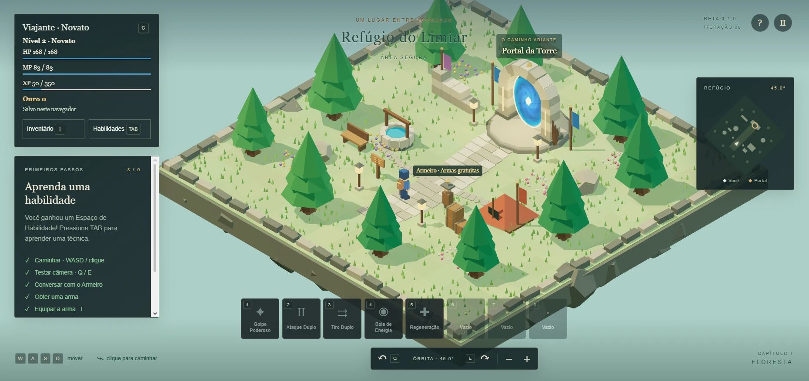
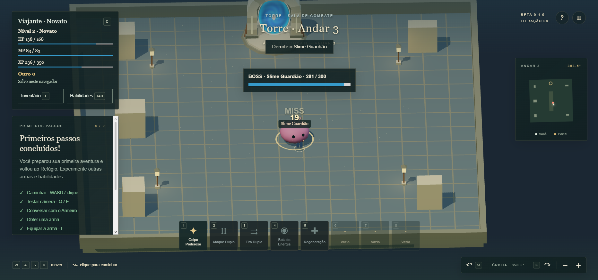
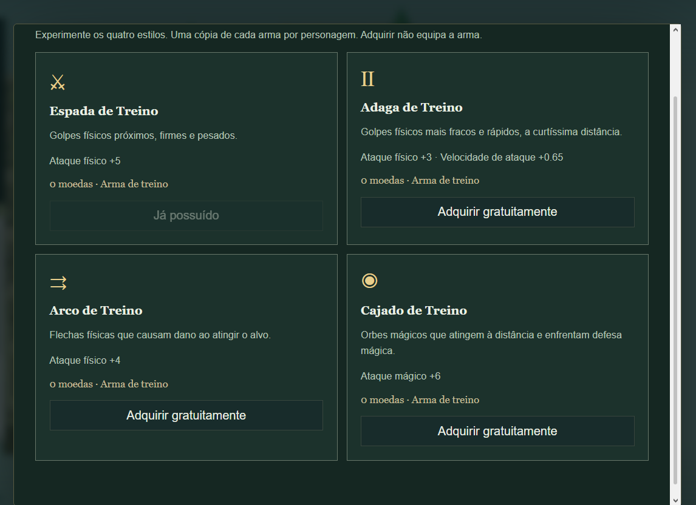
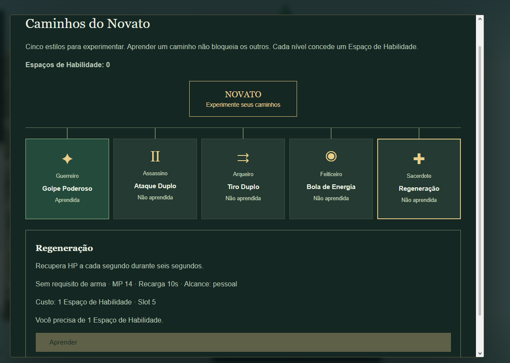

# Dungeon Teacher — Beta 0.1.0

A roguelite-ish tower climber (in quotes because it's not quite a traditional roguelike) built with **Three.js (3D)**, inspired by Ragnarok Online's dungeon loop and general Sword Art Online vibes. Pick a weapon, climb the procedural tower fighting for drops and boss chests, then return to the hub — or die trying — to level up, learn skills and gear up before heading back in stronger.

The educational hook: chests have rarities, and opening one triggers an educational question — answer correctly and the odds shift toward better loot. That layer isn't built yet; this beta is the RPG foundation it will sit on: a hub town, a procedurally generated tower, five weapon-based classes, a skill tree, chest-based rewards and full save persistence. Planned life-skill systems (also not implemented) will add fishing and mining floors, feeding a Black Desert-style forging/upgrading system.

**Status: actively in development**, worked on weekly. Current build: **Iteration 09 — Forest exploration** (manual acceptance in progress).

## Screenshots
*(placeholder art — geometric shapes and default assets, not final visuals)*

| Hub — Refúgio do Limiar | Boss fight |
|---|---|
|  |  |

| Choosing a weapon/class | Skill tree |
|---|---|
|  |  |

## First expedition

1. Follow First Steps: walk around, try the camera and talk to the Armorer using F.
2. Get a free weapon, open I and equip it. You start with no skills and no Skill Slots.
3. Use F on the Portal with a weapon equipped. The Tower generates three floors per seed.
4. Click Slimes to attack; only valid hostile hits provoke them. Learned skills use 1–5. They wander passively until they take damage and don't respawn during this expedition.
5. Follow the golden trail through forest regions. Two required encounters release their local root barriers. Optional detours grant extra XP and can be skipped. Find the exit physically.
6. On the third floor, reach the Guardian clearing after releasing the required passages; the boss then appears after two seconds. Defeat it, grab the chest with F, and head back through the portal.
7. Open I at the Hub, select the chest and click Open. Space slows down the wheel until the result lands. You receive equipment and gold.
8. Enemies grant XP; each level grants 5 attribute points and 1 Skill Slot. In TAB, each technique costs 1 Slot; all five are independent. Open C at the Hub to distribute points without spending XP or gold. You stay a Novice.
9. Equip the reward in I and start another expedition.

Dying sends you back to the Hub with full HP/MP and ends the run. Resources and items already received are kept. Interacting near the entrance lets you abandon the run. Reloading also starts you at the Hub, without restoring an expedition in progress.

Inventory, equipment, skills, attributes, XP, gold, chests and onboarding all persist. Opening panels pauses the simulation. Equipment can't be swapped during combat. The chest requires the Hub and a free slot; the grant and its consumption are saved together.

Iteration 09 report: not written yet (manual acceptance still in progress). · [Prompt](docs/ITERACAO-09-PROMPT.md) · [CPU measurements](docs/ITERACAO-09-PERFORMANCE.json).

Progression version 4 resets old saves once and logs the migration before the game opens. Reloading preserves the new progress. Sword and dagger attack in melee; bow and staff launch physical and magical projectiles. Common Slimes, Jumpers and Mages share the same AI, with varied encounters per seed.

To reproduce maps: `?debug=1&test=1&seed=42`. Debug shows the run's seed, floor and derived seed. The `test=1` profile is separate from the normal one. Without an explicit seed, each expedition rolls a new one.

## Play

With this session's server running, open **http://127.0.0.1:5173/**.

To open it again on Windows, run `INICIAR-JOGO.cmd`. Keep the server window open while playing. If the port is already in use by the game, just open the address above.

On the first install on another machine: Node.js 22.12+ (or 24+) and `npm ci`. Packages are installed from the npm registry, and exact versions are pinned in the lockfile.

```sh
npm ci
npm run dev -- --port 5173 --strictPort
```

Don't open `index.html` by double-clicking: the modules need the local server. There's no account, backend or remote game service. No asset or library is fetched from a CDN at runtime.

## Controls

| Action | Control |
|---|---|
| Walk | WASD or arrow keys, relative to the camera |
| Pathfind | Click on the ground |
| Cancel path | WASD or Esc |
| Rotate camera | Hold Q / E or the bottom buttons; release to stop at the exact angle |
| Orbit with mouse | Hold the middle button and drag horizontally |
| Zoom | Mouse wheel, + / − or the bottom buttons |
| Contextual interaction | F or the indicated action button; the Portal and the welcome sign use the same system |
| Pause | Esc with no active path, the top button, or leaving the window |
| Character and attributes | C or the Traveler button on the HUD |
| Inventory and equipment | I or the Inventory button |
| Skill tree | TAB or the Skills button |
| Skills | Keys 1–8 or click on the hotbar |
| Help | H or the ? button |

## Included in this build

- Low-complexity 3D scenery with warm lighting, living vegetation, flowers, banners, turquoise water and an animated blue portal.
- Original placeholder 2D sprite character, eight-direction atlas, Idle/Walk and ground marker.
- Circular collision against trees, rocks, ruins, tent, well and clearing boundaries.
- Grid-based A* with smoothing across free segments; path and destination are visible.
- Continuous orbit camera, pivoting on the character, fixed tilt and smooth, limited zoom.
- Registered trees and structures turn translucent when they occlude the character.
- Hub minimap; forest landmarks, golden trail markers, optional detour signs, help and pause.
- Fixed-step simulation, decoupled from rendering, input and UI.
- Hub content and interactions in validated JSON, plus 245 automated tests covering domain, combat, areas and persistence.

## Limits of this version

There are three controlled procedural floors, one placeholder boss and eight reward items. Playable classes, a full economy, educational questions, multiplayer and content beyond the third floor are not implemented. The sections below document the history; the current rules above take precedence.

Art is made of plain geometry and local effects, with no final assets. This build does not represent final visual quality. WebGL 2 and graphics acceleration are required. Mobile has not been validated.

## Development and verification

```sh
npm test
npm run build
npm run preview -- --port 4173 --strictPort
```

`?perf=1` shows a sample of FPS and p95 frame interval, without enabling debug. `node scripts/iteration08-performance.mjs` reproduces the synthetic simulation benchmark (5/20 enemies), separate from the graphics measurement.

`npm test` uses Node's native test runner and doesn't need a browser. The static build is generated into `dist/`. The graphics bundle size warning doesn't block the build; measuring and optimizing it is part of upcoming performance work.

Responsibilities: `src/core/` holds configuration and validation; `src/world/`, collision/navigation; `src/simulation/`, state and movement; `src/adapters/`, keyboard/mouse and Three.js; `src/ui/`, the HUD; `src/data/`, the map. Combat and skill rules live in the domain and simulation layers; the renderer only presents them.

Documentation: full plan in `docs/PLANO-TECNICO-BETA-0.1.0.md`, this build's decisions in `docs/DECISOES-FUNDACAO.md`, and verification in `docs/VERIFICACAO-FUNDACAO.md`. The original spec text is preserved in `docs/ESPECIFICACAO-ORIGINAL-BETA-0.1.0.txt`. Files under `sources/` are never modified.

**Iteration 02 log:** foundation for movement, camera, interaction and hybrid visuals. Attack/Skill/Hit/Death are planned in the animation contract but not yet implemented. See `docs/ITERACAO-02.md` for decisions, files and verification. The Iteration 02 spec supersedes the old four-direction and 3D-character choices; the rest of the plan remains as reference.

Current fix: eight full-body poses, stable selection by relative angle, and a collapsible debug panel. Inspect the poses at `http://127.0.0.1:5173/sprite-lab.html` (dev server). Details in `docs/ITERACAO-02.1.md`.

## Character and persistence — Iteration 03

Level 1 Novice with six attributes at 5. Each level grants 5 points. C opens the sheet with a preview, Confirm and Cancel; closing it discards unconfirmed changes. Distributing points requires being at the safe Hub and out of combat. The panel pauses exploration and regeneration.

HP, MP, XP, level and attributes are saved to IndexedDB, scoped to this browser and address. Confirmed changes and debug actions save immediately; regeneration is consolidated every 2 seconds and when leaving the window. An abrupt close can lose the last few seconds of regeneration. There's no offline regeneration. The technical level cap is 100, and attack speed ranges from 0.25 to 4 attacks/s; both are provisional numbers.

To test without altering your character, open `http://127.0.0.1:5173/?debug=1&test=1` and use C → Test tools. Only `?debug=1` applies test actions to the normal profile. The test profile uses a separate key in the same database. The normal screen doesn't expose these commands.

The save contains the data source, version 0.1.0 and schema 1. Derived values are rebuilt on load. Missing fields fall back to defaults; invalid or future formats are never overwritten. Transactions keep a previous copy and reject concurrent writes from tabs with an outdated revision. On error, read the save warning; reopen the page to load the last confirmed state. There's no sync between browsers.

Architecture and checks: [Iteration 03 report](docs/ITERACAO-03-RELATORIO.md).

## Training combat — Iteration 04

Click directly on the Training Slime: the character approaches and starts auto-attacking. The circle and HP bar indicate the target. WASD, clicking the ground or Esc interrupt the auto intention; the selection may remain. F is still the contextual interaction. In Iteration 05, Slimes detect, chase and attack under their own perception rules.

When defeated, the character returns to the start with full HP/MP after 3 seconds. Each Slime disappears after being defeated and respawns after 8 seconds, waiting if its spawn point is occupied. No XP or loot is granted.

With `?debug=1&test=1`, open Combat Debug to watch state, interval, range, stats and the last result; uncheck AI and active attacks to isolate the player's attack. The test profile is separate from the normal one.

[Iteration 04 report](docs/ITERACAO-04-RELATORIO.md): files, architecture, formulas, cancellations, limitations and tests. This report documents the previous build; Iteration 05 is described below.

## History: AI and groups — Iteration 05

The training area now has six Slimes with individual perception, pathfinding-based chase, return-to-origin and respawn. Getting too close can pull in every Slime that sees you. There's no artificial aggro cap. Fleeing far enough makes each Slime return to its origin, gradually healing. During that return, it's temporarily immune and can't be selected.

The player can push bodies they're in contact with, and enemies separate from each other locally. Death clears aggro and pending attacks. There's no XP or loot per enemy. Camera, attributes, regeneration and saving follow the previous rules.

Scale test: `http://127.0.0.1:5173/?debug=1&test=1&stress=1`. The `stress` parameter requires `debug=1` and spawns twenty enemies. In Combat Debug, enable the visualization for sight, range, leash and paths. The `test=1` profile preserves the normal character.

[Iteration 05 report](docs/ITERACAO-05-RELATORIO.md): files, state machine, parameters, tests, observed performance and limitations. Iteration 06 is described below.

## History: the Novice's first kit — Iteration 06

The hotbar responds to clicks and keys 1–8: Powerful Strike (sword), Double Attack (dagger), Double Shot (bow), Energy Ball (staff), Regeneration (any weapon) and three empty slots. Select an enemy before offensive techniques; the character closes in to the skill's range. Regeneration restores HP over six pulses.

Incompatible techniques appear dimmed. Hover to check weapon, MP, cooldown and range. Only one technique can be pending at a time; the most recent intent replaces the previous one. Costs are applied on valid execution. Interrupting a technique already in progress doesn't refund MP or cooldown. Pausing freezes skills.

To try all four weapons, open `http://127.0.0.1:5173/?debug=1&test=1` → Combat Debug → Provisional weapon. Switching is locked while a skill is executing. This profile preserves the normal character. Known weapon and skills are saved; cooldowns and active effects reset on reload. Auto-attack still keeps the previous short physical range for every weapon.

[Iteration 06 report](docs/ITERACAO-06-RELATORIO.md): architecture, parameters, rules, tests and limits. [Progression guidelines](docs/DIRETRIZES-DE-PROGRESSAO.md): the philosophy behind the 13 weeks. The character remains a Novice; class change hasn't started yet.

