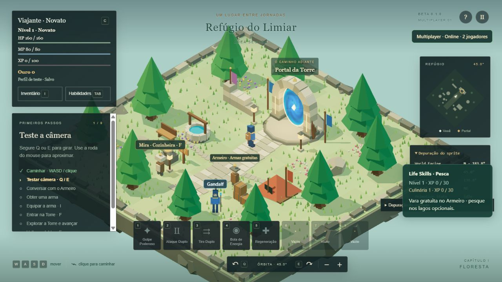

# Dungeon Teacher — Beta 0.1.5 (Smithing, experimental)

A roguelite-ish tower climber (in quotes because it's not quite a traditional roguelike) built with **Three.js (3D)**, inspired by Ragnarok Online's dungeon loop and general Sword Art Online vibes. Pick a weapon, climb the procedural tower fighting for drops and boss chests, then return to the hub — or die trying — to level up, learn skills and gear up before heading back in stronger.

The educational hook: chests have rarities, and opening one triggers an educational question — answer correctly and the odds shift toward better loot. That layer isn't built yet; this beta is the RPG foundation it will sit on: a hub town, a procedurally generated tower, five weapon-based classes, a skill tree, chest-based rewards and full save persistence. Fishing is implemented as an optional activity at existing lakes, with its own levels, five species and persistent ingredient stacks. Cooking now adds six recipes, consumable fish and dishes, four temporary food buffs, and a local ingredient shop/buyback economy. Mining is now the third life skill: buy a Simple Pickaxe from the Armorer, break mineral veins in caves with a timing minigame and collect Raw Ore. Smithing is the fourth: a Forge station in the Refuge turns Raw Ore into weapons of varying quality.

**Current distribution: Beta 0.1.5 / Smithing (experimental).** A Forge station in the Refuge lets you turn Raw Ore into a weapon through a three-hammer timing minigame: FALHA (below the Armorer's equivalent), BOM (a little above it) or PERFEITO (above BOM). Every completed attempt spends the ore, yields exactly one weapon, grants Smithing XP and counts as practice for that recipe. Quality changes only the weapon's damage. See the [Iteration 15 report](docs/ITERACAO-15-RELATORIO.md) and `release/smithing-playtest/`.

> **Status:** Iteration 14 (Tower Progression, Beta 0.1.4) was approved by the project owner after a manual playtest on 2026-10-09: it works as intended, including the random biome alternation. Smithing (Iteration 15, this build) has now also been manually playtested and approved. The 0.1.4 release stays available on its own.

**Previous distribution: Beta 0.1.4 / TowerProgression (approved in manual playtest).** The normal expedition no longer ends at the floor-3 Guardian: after the boss you choose between a climb portal (floor 4 and beyond, up to floor 50) and a return portal to the Refuge. Floors 1–2 are always Forest; the first Forest → Cave transition lands between floors 3 and 5 and the biomes then alternate in cycles. Cleared floors are remembered (`Maior andar concluído`, press C): on a revisit their encounter gates are open, but every enemy stays. The Guardian's chest is granted once per character. Explorar biomas stays a test tool and never touches campaign progress. See the [Iteration 14 report](docs/ITERACAO-14-RELATORIO.md). Earlier delivery notes below are historical.

## Screenshots
*(placeholder art — geometric shapes and default assets, not final visuals)*

| Hub — Refúgio do Limiar | Boss fight |
|---|---|
|  |  |

| Choosing a weapon/class | Skill tree |
|---|---|
|  |  |

| Cooking minigame | Multiplayer (2 players in the Hub) |
|---|---|
|  |  |

## First expedition

1. Follow First Steps: walk around, try the camera and talk to the Armorer using F.
2. Get a free weapon, open I and equip it. You start with no skills and no Skill Slots.
3. Use F on the Portal with a weapon equipped. The Tower generates three floors per seed.
4. Click Slimes to attack; only valid hostile hits provoke them. Learned skills use 1–5. They wander passively until they take damage and don't respawn during this expedition.
5. Follow the golden trail through forest regions. Two required encounters release their local root barriers. Optional detours grant extra XP and can be skipped. Find the exit physically.
6. On the third floor, reach the Guardian clearing after releasing the required passages; the boss then appears after two seconds. Defeat it, grab the chest with F, and head back through the portal.
7. Open I at the Hub, select the chest and click Open. Space slows down the wheel until the result lands. You receive equipment and gold.
8. Enemies grant XP; each level grants 5 attribute points and 1 Skill Slot. In TAB, each technique costs 1 Slot; all five are independent. Open C at the Hub to distribute points without spending XP or gold. You stay a Novice.
9. Equip the reward in I and start another expedition.

Dying sends you back to the Hub with full HP/MP and ends the run. Resources and items already received are kept. Interacting near the entrance lets you abandon the run. Reloading also starts you at the Hub, without restoring an expedition in progress.

Inventory, equipment, skills, attributes, XP, gold, chests and onboarding all persist. Opening panels pauses the simulation. Equipment can't be swapped during combat. The chest requires the Hub and a free slot; the grant and its consumption are saved together.

[Iteration 09 report](docs/ITERACAO-09-RELATORIO.md) · [Prompt](docs/ITERACAO-09-PROMPT.md) · [CPU measurements](docs/ITERACAO-09-PERFORMANCE.json).

Progression version 4 resets old saves once and logs the migration before the game opens. Reloading preserves the new progress. Sword and dagger attack in melee; bow and staff launch physical and magical projectiles. Common Slimes, Jumpers and Mages share the same AI, with varied encounters per seed.

To reproduce maps: `?debug=1&test=1&seed=42`. Debug shows the run's seed, floor and derived seed. The `test=1` profile is separate from the normal one. Without an explicit seed, each expedition rolls a new one.

## Play

With this session's server running, open **http://127.0.0.1:5173/**.

To open it again on Windows, run `INICIAR-JOGO.cmd`. Keep the server window open while playing. If the port is already in use by the game, just open the address above.

On the first install on another machine: Node.js 22.12+ (or 24+) and `npm ci`. Packages are installed from the npm registry, and exact versions are pinned in the lockfile.

```sh
npm ci
npm run dev -- --port 5173 --strictPort
```

Don't open `index.html` by double-clicking: the modules need the local server. There's no account, backend or remote game service. No asset or library is fetched from a CDN at runtime.

## Controls

| Action | Control |
|---|---|
| Walk | WASD or arrow keys, relative to the camera |
| Pathfind | Click on the ground |
| Cancel path | WASD or Esc |
| Rotate camera | Hold Q / E or the bottom buttons; release to stop at the exact angle |
| Orbit with mouse | Hold the middle button and drag horizontally |
| Zoom | Mouse wheel, + / − or the bottom buttons |
| Contextual interaction | F or the indicated action button; the Portal and the welcome sign use the same system |
| Pause | Esc with no active path, the top button, or leaving the window |
| Character and attributes | C or the Traveler button on the HUD |
| Inventory and equipment | I or the Inventory button |
| Skill tree | TAB or the Skills button |
| Skills | Keys 1–8 or click on the hotbar |
| Help | H or the ? button |

## Included in this build

- Low-complexity 3D scenery with warm lighting, living vegetation, flowers, banners, turquoise water and an animated blue portal.
- Original placeholder 2D sprite character, eight-direction atlas, Idle/Walk and ground marker.
- Circular collision against trees, rocks, ruins, tent, well and clearing boundaries.
- Grid-based A* with smoothing across free segments; path and destination are visible.
- Continuous orbit camera, pivoting on the character, fixed tilt and smooth, limited zoom.
- Registered trees and structures turn translucent when they occlude the character.
- Hub minimap; forest landmarks, golden trail markers, optional detour signs, help and pause.
- Fixed-step simulation, decoupled from rendering, input and UI.
- Hub content and interactions in validated JSON, plus 247 automated tests covering domain, combat, areas and persistence.

## Limits of this version

There are three controlled procedural floors, one placeholder boss and eight reward items. Fishing, cooking and mining are implemented; smithing is not yet. Raw Ore has no use yet and cannot be sold. Multiplayer covers shared Hub presence only — no PvP, no shared tower runs. The Forest and Cave biomes are literal templates: current shape, size and enemies are placeholders and will change as the biome system matures. Playable classes, a full economy and educational questions are not implemented. The sections below document the history; the current rules above take precedence.

Almost everything visible is a placeholder: plain geometry, local effects and no final assets anywhere in the game. What's solid is the code underneath — movement, combat, systems — not the art on top of it. Enemies will likely keep their current roles but get a visual overhaul; nothing currently on screen should be read as final. WebGL 2 and graphics acceleration are required. Mobile has not been validated.

## Development and verification

```sh
npm test
npm run build
npm run preview -- --port 4173 --strictPort
```

`?perf=1` shows a sample of FPS and p95 frame interval, without enabling debug. `node scripts/iteration08-performance.mjs` reproduces the synthetic simulation benchmark (5/20 enemies), separate from the graphics measurement.

`npm test` uses Node's native test runner and doesn't need a browser. The static build is generated into `dist/`. The graphics bundle size warning doesn't block the build; measuring and optimizing it is part of upcoming performance work.

Responsibilities: `src/core/` holds configuration and validation; `src/world/`, collision/navigation; `src/simulation/`, state and movement; `src/adapters/`, keyboard/mouse and Three.js; `src/ui/`, the HUD; `src/data/`, the map. Combat and skill rules live in the domain and simulation layers; the renderer only presents them.

Documentation: full plan in `docs/PLANO-TECNICO-BETA-0.1.0.md`, this build's decisions in `docs/DECISOES-FUNDACAO.md`, and verification in `docs/VERIFICACAO-FUNDACAO.md`. The original spec text is preserved in `docs/ESPECIFICACAO-ORIGINAL-BETA-0.1.0.txt`. Files under `sources/` are never modified.

**Iteration 02 log:** foundation for movement, camera, interaction and hybrid visuals. Attack/Skill/Hit/Death are planned in the animation contract but not yet implemented. See `docs/ITERACAO-02.md` for decisions, files and verification. The Iteration 02 spec supersedes the old four-direction and 3D-character choices; the rest of the plan remains as reference.

Current fix: eight full-body poses, stable selection by relative angle, and a collapsible debug panel. Inspect the poses at `http://127.0.0.1:5173/sprite-lab.html` (dev server). Details in `docs/ITERACAO-02.1.md`.

## Character and persistence — Iteration 03

Level 1 Novice with six attributes at 5. Each level grants 5 points. C opens the sheet with a preview, Confirm and Cancel; closing it discards unconfirmed changes. Distributing points requires being at the safe Hub and out of combat. The panel pauses exploration and regeneration.

HP, MP, XP, level and attributes are saved to IndexedDB, scoped to this browser and address. Confirmed changes and debug actions save immediately; regeneration is consolidated every 2 seconds and when leaving the window. An abrupt close can lose the last few seconds of regeneration. There's no offline regeneration. The technical level cap is 100, and attack speed ranges from 0.25 to 4 attacks/s; both are provisional numbers.

To test without altering your character, open `http://127.0.0.1:5173/?debug=1&test=1` and use C → Test tools. Only `?debug=1` applies test actions to the normal profile. The test profile uses a separate key in the same database. The normal screen doesn't expose these commands.

The save contains the data source, version 0.1.0 and schema 1. Derived values are rebuilt on load. Missing fields fall back to defaults; invalid or future formats are never overwritten. Transactions keep a previous copy and reject concurrent writes from tabs with an outdated revision. On error, read the save warning; reopen the page to load the last confirmed state. There's no sync between browsers.

Architecture and checks: [Iteration 03 report](docs/ITERACAO-03-RELATORIO.md).

## Training combat — Iteration 04

Click directly on the Training Slime: the character approaches and starts auto-attacking. The circle and HP bar indicate the target. WASD, clicking the ground or Esc interrupt the auto intention; the selection may remain. F is still the contextual interaction. In Iteration 05, Slimes detect, chase and attack under their own perception rules.

When defeated, the character returns to the start with full HP/MP after 3 seconds. Each Slime disappears after being defeated and respawns after 8 seconds, waiting if its spawn point is occupied. No XP or loot is granted.

With `?debug=1&test=1`, open Combat Debug to watch state, interval, range, stats and the last result; uncheck AI and active attacks to isolate the player's attack. The test profile is separate from the normal one.

[Iteration 04 report](docs/ITERACAO-04-RELATORIO.md): files, architecture, formulas, cancellations, limitations and tests. This report documents the previous build; Iteration 05 is described below.

## History: AI and groups — Iteration 05

The training area now has six Slimes with individual perception, pathfinding-based chase, return-to-origin and respawn. Getting too close can pull in every Slime that sees you. There's no artificial aggro cap. Fleeing far enough makes each Slime return to its origin, gradually healing. During that return, it's temporarily immune and can't be selected.

The player can push bodies they're in contact with, and enemies separate from each other locally. Death clears aggro and pending attacks. There's no XP or loot per enemy. Camera, attributes, regeneration and saving follow the previous rules.

Scale test: `http://127.0.0.1:5173/?debug=1&test=1&stress=1`. The `stress` parameter requires `debug=1` and spawns twenty enemies. In Combat Debug, enable the visualization for sight, range, leash and paths. The `test=1` profile preserves the normal character.

[Iteration 05 report](docs/ITERACAO-05-RELATORIO.md): files, state machine, parameters, tests, observed performance and limitations. Iteration 06 is described below.

## History: the Novice's first kit — Iteration 06

The hotbar responds to clicks and keys 1–8: Powerful Strike (sword), Double Attack (dagger), Double Shot (bow), Energy Ball (staff), Regeneration (any weapon) and three empty slots. Select an enemy before offensive techniques; the character closes in to the skill's range. Regeneration restores HP over six pulses.

Incompatible techniques appear dimmed. Hover to check weapon, MP, cooldown and range. Only one technique can be pending at a time; the most recent intent replaces the previous one. Costs are applied on valid execution. Interrupting a technique already in progress doesn't refund MP or cooldown. Pausing freezes skills.

To try all four weapons, open `http://127.0.0.1:5173/?debug=1&test=1` → Combat Debug → Provisional weapon. Switching is locked while a skill is executing. This profile preserves the normal character. Known weapon and skills are saved; cooldowns and active effects reset on reload. Auto-attack still keeps the previous short physical range for every weapon.

[Iteration 06 report](docs/ITERACAO-06-RELATORIO.md): architecture, parameters, rules, tests and limits. [Progression guidelines](docs/DIRETRIZES-DE-PROGRESSAO.md): the philosophy behind the 13 weeks. The character remains a Novice; class change hasn't started yet.


## Cooking and food (Iteration 11)

Visit Mira or the stove in the Refuge and press F. Buy ingredients, choose a recipe and press F/Space in the green or gold timing zone. Cooking gains its own XP; even a missed timing produces the normal dish with less XP. Open I to eat fish or dishes outside combat. Food shares an 8-second cooldown; one 5-minute food buff can be active at a time. Sell fish or dishes to Mira for gold. Buff deadlines, cooldowns, items, gold and profession progress survive reload.

## Smithing (Iteration 15, experimental)

**Forge.** A station next to the path between the Armorer and the portal (`forge` obstacle and interaction, `src/simulation/areas.js`). F opens the Forge dialog (`src/ui/forge-panel.js`): recipes, ore required and owned, expected damage per quality next to the Armorer's reference, Smithing level and XP, practice per recipe.

**Minigame** (`src/domain/smithing-service.js`, tuning in `src/domain/smithing.js`). A short heating phase, then three hammers: a marker crosses the bar and F/Space must land in the bright zone (precise ±5%, acceptable ±13%). Points 2/1/0 per hammer: 5 or more is PERFEITO, 3 or 4 is BOM, otherwise FALHA. A hammer left unused counts as a miss, so an attempt cannot stall. Time is simulation time advanced by `update(dt)`, not frames or wall clock. **Commit point:** until the first hammer window opens the attempt can be cancelled or closed at no cost; afterwards it always ends in a result. Nothing is spent before the end: ore, the weapon, XP and practice change in one transaction (`prepare` on a copy, one `save`, then applied), so an app close or a save error leaves the character untouched.

**Weapons.** One item per recipe and quality (`forgedSwordFailure/Good/Perfect`, and the same for dagger, bow and staff), generated from the Armorer's equivalent weapon: every stat, range and speed is copied and only the damage stat moves by −1 / +1 / +2. The Armorer's weapons are unique; forged ones are not, so several qualities can coexist. They never appear in the Armorer's shop.

**Profession and practice.** Smithing is an independent life skill on the shared curve (XP by quality, FALHA included). `character.smithingMastery[recipeId].attempts` counts completed attempts per recipe; it records practice only. No automation, bars, alloys, components or refinement yet.

## Tower progression (Iteration 14)

**Biome rules** (`src/world/biomes.js`, tables in `BIOME_RULES`): the chance that a floor starts a transition depends on how many pure floors have passed. First transition: floors 1–2 never, floor 3 50%, floor 4 75%, floor 5 guaranteed. After a transition the next floor is always a pure floor of the destination biome, then 10% → 50% → 75% → 100% per floor. Directions are fixed (Forest → Forest-to-Cave → Cave → Cave-to-Forest → Forest) and transitions are never back to back. The decision *when* (`transitionChance`) is separate from *where to* (`transitionTargets`), so more biomes only extend the second. The sequence is deterministic per seed on its own random stream (`biome-sequence:v2`) and never consumes layout RNG; layouts of every environment are byte-identical to Iteration 13.

**Campaign.** The boss floor keeps its role independent of its biome. Its main portal climbs to floor 4; a second portal returns to the Refuge; both need the Guardian dead and the chest taken, and nothing starts by itself. Floors beyond 3 are generated on demand from the run seed up to `TOWER_LIMIT = 50`, where the portal simply ends the run (there is no final boss yet). Enemy HP, attack and XP grow gently past floor 3 (`POST_THREE`, provisional).

**Progress.** `character.tower = {highestClearedFloor, claimedRewards}` is saved with the character (additive: older saves start at 0 and nothing is inferred). A floor is cleared in the campaign when its challenges are resolved (floor 3: the Guardian is dead). Entering a floor, teleporting in debug, stress mode and Explorar biomas never advance it. Revisiting a cleared floor opens its gates and spares the Guardian; enemies, XP, Fishing and Mining are untouched. The portal still starts at floor 1.

## Mining (Iteration 13)

Buy the **Simple Pickaxe** from the Armorer (30 gold). It lives in the bag like the fishing rod: no equipment slot, no durability, one per character. Mineral veins (pale rock with amber crystals) only spawn on Cave floors and on the underground side of the two transitions, mostly in optional detours; pure Forest has none, so the normal three-floor expedition has no veins. Walk up to a vein and press F: a bar appears with a sweeping indicator, and F or Space in the green zone is GOOD, in the gold zone PERFECT. A success gives 1 Raw Ore and Mining XP (8 GOOD, 12 PERFECT); a miss costs nothing and allows a retry after a short pause. Each vein pays once and is spent for that floor. Mining has its own level and XP (shown in the Life Skills panel), shares the same XP curve as Fishing and Cooking and never touches combat XP. Esc cancels; taking damage, dying or leaving the floor also cancels with no reward.

The Armorer's paid stock is declared in `src/domain/shop.js`; timing and balance in `src/domain/mining.js`; vein placement in `src/world/mineral-veins.js` (own seed stream, so existing floors stay byte-identical); the runtime in `src/simulation/mining.js`. Report: [Iteration 13](docs/ITERACAO-13-RELATORIO.md).

## Windows — Desktop Build 01

The same web game is packaged with Electron 44.5.1 and electron-builder 26.15.3.

- `npm run desktop:dev`: builds and opens the development shell.
- `npm run desktop:build`: generates the shared production assets.
- `npm run desktop:package`: prepares the official runtime and generates an NSIS installer and a Portable Windows x64 build in `release/desktop-01`.
- Close any executable open from that folder before packaging again. To keep it running, use `npm run desktop:package -- --config.directories.output=release/desktop-01-final`.
- The runtime installer is run explicitly, and `electronDist` uses its extracted folder. This avoids the EPERM rename failure seen in the packager's default extractor in this environment.
- The dev machine needs Node/dependencies and network access for the initial downloads. The playtester only receives the Setup or Portable build and doesn't need any of those tools.

The renderer loads `dungeon://game/index.html` from inside the ASAR, with no HTTP server. IndexedDB uses `%APPDATA%\Dungeon Master` and doesn't import the web save. Installer and Portable share the same Windows user profile. The domain stays shared; a restricted bridge flushes the save on close.

[Desktop 01 report](docs/DESKTOP-01-RELATORIO.md) and [playtest instructions](desktop/LEIA-ME.txt). Visual validation of the executable and a close/reopen pass are still pending, since native window control wasn't available in this session — don't treat the build as fully verified yet.

## Multiplayer 01 — shared Hub

The Node/WebSocket server lives separately in `server/`; the shared protocol is in `shared/multiplayer.js`. The client only connects on player action, sending UUID, name and movement state at up to 15 Hz. Remote players use 100 ms interpolation, with orientation computed from the observer's own camera. Entering the Tower ends your presence; returning to the Hub reconnects. Save, inventory and gameplay all stay local.

Additional commands:

- `npm run server:install`: installs only the server's dependency.
- `npm run server:start`: starts the local backend.
- `npm run test:multiplayer`: protocol, server, client and security tests.
- `npm run multiplayer:configure -- wss://YOUR-REAL-DOMAIN/hub`: configures the next build's endpoint, for both the renderer and the allowlist/CSP.
- `npm run desktop:package:playtest`: requires WSS to be configured before generating a distribution for two PCs.
- `npm run desktop:package`: can also generate an offline candidate, explicitly with no server configured.

Artifacts currently land in `release/multiplayer-01`. Desktop01 is preserved as-is. This build is identified as Multiplayer01 / Windows 0.1.0.2, keeping the same appId and `%APPDATA%\Dungeon Master` profile.

**Validated (Multiplayer 01.1):** the backend is hosted publicly on Render and baked into the distributed build's config. Two-client tests passed with low latency (~150 ms ping) end to end — connect, move sync, disconnect, reconnect. PvP is planned for later, so this will need another latency/security pass before that lands; for now, shared presence in the Hub is solid.

[Exact backend deploy steps](server/DEPLOY.md), [report](docs/MULTIPLAYER-01-RELATORIO.md) and [two-PC walkthrough](desktop/TESTE-MULTIPLAYER-01.txt).

