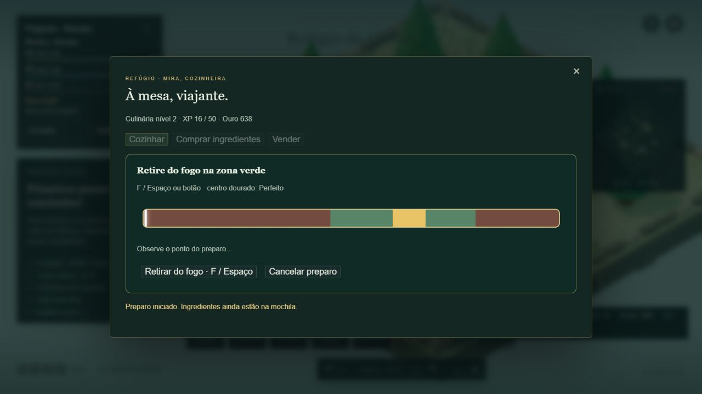

# Iteração 11 — Cooking, consumíveis e economia local

Implementação em 05/10/2026. Escopo encerrado nesta iteração. Validação manual concentrada no Refúgio e em um trecho do Andar 1 com lago; regressões amplas cobertas pela suíte.

## 1. Auditoria inicial
Antes de alterar o código, os 279 testes existentes passaram (115,0 s) e o build foi gerado. Foram revisados inventário, equipamentos, stats, persistência, profissões, pesca, interações e pausa. Fishing manteve RNG, espécies, probabilidades, tempos, XP e pontos de pesca. O save existente foi preservado e recebeu os novos campos de forma aditiva.

## 2. Fundação de consumíveis
As definições dos itens contêm efeitos, categoria de recarga e valor de venda. FoodService coordena consumo e transações; Inventory remove quantidades e pilhas; Character aplica recuperação e recalcula stats. A interface apenas apresenta e solicita ações. Peixes continuam recursos/ingredientes empilháveis compatíveis com saves anteriores, agora com efeitos consumíveis. Pratos têm categoria consumable/food/cooked.

Consumo pelo inventário (I): selecionar item → Comer. Comer em combate ou durante outra atividade é bloqueado. Esta decisão preserva a pausa já existente do inventário sem criar uma forma de cura instantânea durante a luta. Uma futura hotbar de consumíveis fica fora do escopo. Vida/mana cheias impedem gastar alimentos que apenas recuperariam aquele recurso; pratos com buff podem ser consumidos para aplicar ou renovar o bônus.

## 3. Peixes crus
| Espécie | Recuperação | Venda NPC |
|---|---|---:|
| Lambari do Limiar | 15 HP | 4 |
| Carpa dos Vaga-lumes | 25 HP | 7 |
| Bagre Musgoso | 35 HP | 10 |
| Peixe-Lua | 20 MP | 12 |
| Peixe Rúnico | 25 HP + 20 MP | 18 |

Recuperação limitada ao máximo atual. O peixe misto pode ser usado se ao menos um recurso estiver abaixo do máximo. Preços em ouro por unidade.

## 4. Cooldowns
Recarga global da categoria comida: 8 segundos, compartilhada por todos os peixes e pratos. O botão mostra a contagem e fica indisponível enquanto ela corre. O domínio também rejeita tentativas duplicadas. Prazo absoluto persistido: pausar, recarregar ou ficar offline não reinicia nem congela a recarga.

## 5. Cooking
Culinária inicia no nível 1, XP 0. XP independente do personagem e de Fishing. Curva centralizada em LIFE_BALANCE: 30 + 20 × (nível − 1), teto provisório 50. Ganho acumula progresso, sobe níveis e libera receitas; nunca funciona como moeda. Saves antigos recebem Cooking sem perder Fishing.

## 6. Cozinheiro
Mira e seu fogão ficam no Refúgio, próximos à placa. F abre a cozinha pelo NPC ou pela estação. Serviços: Cozinhar, Comprar ingredientes, Vender e Sair. NPC com chapéu/avental, fogão e panela geométricos. Navegação até cozinha, armeiro e portal verificada por teste. Serviços indisponíveis na Torre.

## 7. Ingredientes
| Ingrediente | Compra | Venda | Uso |
|---|---:|---:|---|
| Sal | 2 | 1 | Assado e prato rúnico |
| Farinha | 3 | 1 | Carpa dourada |
| Ervas | 4 | 2 | Ensopado, sopa e bagre |
| Óleo | 4 | 2 | Carpa e prato rúnico |
| Água | 1 | 0 | Ensopado, sopa e prato rúnico |

Cinco ingredientes, pilhas de até 99. Quantidade inteira entre 1 e 99 por operação. Água não aparece na recompra do NPC, pois seu valor de venda é zero.

## 8. Receitas
Todas produzem uma unidade e duram 4 segundos. Cada ingrediente listado é usado uma vez.

| Receita | Nível | Ingredientes | XP Bom |
|---|---:|---|---:|
| Lambari Assado | 1 | Lambari + Sal | 12 |
| Ensopado do Limiar | 1 | Lambari + Bagre + Água + Ervas | 20 |
| Carpa Dourada | 1 | Carpa + Farinha + Óleo | 16 |
| Sopa Lunar | 2 | Peixe-Lua + Água + Ervas | 22 |
| Prato Rúnico | 3 | Peixe Rúnico + Sal + Óleo + Água | 30 |
| Bagre com Ervas | 1 | Bagre + Ervas | 14 |

Catálogo em src/domain/food.js, separado da apresentação. A tela informa ingredientes disponíveis/necessários, nível, efeitos e valor de venda. Receita bloqueada explica o motivo.

## 9. Minigame
Barra de 4 s; F, Espaço ou botão retiram o preparo do fogo. Bom entre 45% e 80%; Perfeito entre 60% e 68%; demais momentos/tempo esgotado são Erro. Bom concede 100% do XP, Perfeito 150%, Erro 50%. Os três resultados entregam o mesmo prato normal: não há raridade ou subtipos de qualidade. A punição inicial é menos XP, sem destruir o investimento.

Esc, cancelamento ou perda de foco antes da conclusão preservam ingredientes. Nada é retirado no início. Na conclusão, nível, ingredientes e espaço são revalidados e a troca é salva atomicamente. FPS não acumula o relógio culinário: a barra reflete tempo decorrido.

## 10. Pratos
| Prato | Recuperação | Buff | Venda |
|---|---|---|---:|
| Lambari Assado | 45 HP | — | 6 |
| Ensopado do Limiar | 100 HP | HP máximo +30 | 19 |
| Carpa Dourada | 65 HP | Ataque físico +4 | 14 |
| Sopa Lunar | 60 MP | MP máximo +20 | 17 |
| Prato Rúnico | 75 HP + 50 MP | Ataque mágico +4 | 25 |
| Bagre com Ervas | 80 HP | — | 14 |

Os pratos superam a recuperação dos peixes crus usados, além dos bônus quando presentes. As pilhas têm até 99 unidades.

## 11. Buffs
Quatro buffs, todos por 300 segundos: Bem alimentado, Vigor culinário, Clareza e Foco culinário. Apenas um buff alimentar por vez; outro prato com buff substitui/renova o anterior, sem somar infinitamente. Peixe cru ou prato sem buff não remove o ativo. Morte remove o buff. Expiração recalcula stats e limita HP/MP ao máximo reduzido. O HUD mostra nome e tempo restante.

## 12. Economia NPC
Compras debitam ouro e entregam ingredientes; vendas retiram a quantidade da pilha selecionada e creditam ouro. O NPC compra apenas itens explicitamente vendáveis com preço positivo. Equipamentos e vara não entram no comércio desta versão. Metadados tradeable/baseSellValue são referências NPC, sem impor preços a um futuro mercado de jogadores. Não há Marketplace implementado.

## 13. Anti-arbitragem
| Receita | Peixes vendidos crus | Ingredientes comprados | Venda do prato | Diferença líquida |
|---|---:|---:|---:|---:|
| Assado | 4 | 2 | 6 | 0 |
| Ensopado | 14 | 5 | 19 | 0 |
| Carpa | 7 | 7 | 14 | 0 |
| Sopa | 12 | 5 | 17 | 0 |
| Rúnico | 18 | 7 | 25 | 0 |
| Bagre | 10 | 4 | 14 | 0 |

Não há lucro automático em comprar ingrediente e revendê-lo. Cozinhar/vender recupera o valor de referência do peixe e dos ingredientes, mas consome pescado e tempo. O incentivo adicional de cozinhar está na utilidade do prato e no XP de profissão, sem criar geração infinita de ouro.

## 14. Persistência
Consumo, compra, venda e preparo trabalham sobre cópia do personagem e só publicam o resultado após o save concluir. Falha deixa o personagem anterior intacto. Bloqueio de operação em andamento e suspensão do autosave durante essas transações impedem duplicação por cliques repetidos. Ingredientes, pratos, ouro, XP/nível de Cooking, buff e cooldown são persistidos. Preparo em andamento não é retomado: ingredientes ainda não foram gastos.

Buffs/cooldowns usam prazos absolutos, validados na carga. Recarga não é apagada por reload; buff expirado offline não retorna. A validação manual recarregou o save com Cooking 2, XP 16/50, ouro 640 e buff ativo: seu prazo continuou de 300 para 289 s, em vez de reiniciar.

## 15. Playtest do peixe
Save real preservado, já com vara adquirida anteriormente. No Andar 1, passagem obrigatória inicial liberada e desvio do Lago dos vaga-lumes alcançado. Capturados Peixe-Lua (+12 XP) e Lambari (+6 XP), elevando Fishing de 2/10 para 2/28. Uma tentativa sem reação deixou o peixe escapar normalmente.

Peixe com recurso cheio foi bloqueado sem remoção. Consumo durante combate também foi bloqueado com mensagem. Para testar recuperação de mana sem depender da regeneração entre ações, foi equipado o Capuz do Aprendiz pelo inventário: capacidade 116 → 134, recurso ainda 116. Comer o Peixe-Lua elevou a mana a 134, retirou uma unidade e iniciou 8 s de recarga. Duas unidades de Lambari permaneceram na mochila. O retorno foi feito pela trilha e pela interação de abandonar na entrada; o Refúgio e o reload preservaram os peixes e a profissão. A primeira luta elevou o personagem de 4 para 5; XP de profissão continuou separado.

## 16. Playtest do Cooking
Usados peixes previamente pescados e preservados no save. Compradas uma Água, uma Erva, uma Farinha e um Óleo (12 ouro). Ensopado preparado em Perfeito com Espaço: +30 XP e Cooking nível 2. Carpa Dourada preparada em Bom com F: +16 XP. Ingredientes retirados e pratos adicionados corretamente. Sopa Lunar desbloqueou por nível e passou a informar falta de peixe, enquanto Prato Rúnico continuou bloqueado no nível 3.

Ensopado consumido no Refúgio: HP máximo e atual 208 → 238, bônus Bem alimentado e recarga visíveis. Reload manteve duração restante. Após 5 min, bônus sumiu e HP máximo voltou a 208 (antes do level up posterior). Após o retorno, Mira foi afastada da placa para ficar visível. A conversa com F foi confirmada na nova posição. Comprado Sal por 2 ouro; cancelamento preservou os 2 Lambaris e o Sal. Um novo preparo retirado cedo produziu Lambari Assado com resultado Erro e +6 XP, preservando o prato como previsto. Estado final: Cooking 2, XP 22/50, ouro 638, um Lambari cru e um Assado guardados. Os testes automatizados também cobrem falhas de save e substituição de buffs.

## 17. Playtest econômico
Saldo inicial 628. Compras de ingredientes: −12 → 616. Venda de uma Carpa Dourada: +14 → 630. Venda de um Bagre Musgoso: +10 → 640. Ambos removidos; reload preservou saldo e remoções. Ensopado foi consumido, não vendido. Uma compra final de Sal para o teste de cancelamento/Erro reduziu o saldo a 638. Não houve edição direta do save, geração artificial de itens ou concessão de ouro para testes.

## 18. Decisões
Existem três motivos claros: comer cru resolve necessidade imediata fora de combate; vender converte pescado em ouro sem comprar ingredientes; cozinhar entrega recuperação maior, buff e progressão de profissão mediante custo e preparo. Vender prato também permite recuperar o investimento e manter o XP já ganho. A regeneração passiva e o personagem já avançado reduzem a urgência da comida contra Slimes iniciais; o balanceamento deve ser revisto a partir de uso real, sem mudar Fishing nesta entrega.

## 19. Testes
Antes: 279/279 e build aprovado. Novos: 52/52 específicos de Iteração 11. Regressão Fishing isolada: 32/32. Suíte final: 331/331, zero falhas, cancelados ou ignorados, 168,8 s. Depois do ajuste exclusivamente visual da posição de Mira, os 83 testes de Cooking/economia/navegação/RPG afetados passaram novamente (4,7 s), sem repetir a suíte ampla nem a expedição. Build final aprovado, 64 módulos.

Três expectativas antigas foram atualizadas pelos contratos deliberadamente alterados: Cooking agora aparece ativa (duas expectativas da Iteração 10); Refúgio agora contém armeiro e cozinheira (uma expectativa da Iteração 06). Nenhum teste removido. A primeira execução ampla apontou somente a contagem antiga de um NPC; após atualização, a suíte inteira passou.

Cobertura nova: migração, validação de dados, efeitos dos cinco peixes, limites de recursos, cooldown global, save/reload, morte/expiração/substituição dos quatro buffs, seis receitas, níveis/XP, três resultados, cancelamento, espaço na mochila, quantidades inválidas, ouro insuficiente, rollback de cada operação, operações simultâneas, venda única, preços e navegação do Refúgio.

## 20. Performance
Build JS: 720,65 → 738,91 kB; gzip 195,73 → 201,04 kB (+5,31 kB). CSS: 22,84 → 24,63 kB; gzip 6,24 → 6,70 kB (+0,46 kB). O aviso de bundle acima de 500 kB já existia.

Adicionados um NPC, fogão/panela simples e painéis DOM. Nenhuma simulação de pesca ou população de inimigos foi ampliada. Indicador durante o teste mostrou aproximadamente 52–117 FPS nos trechos do Andar 1 e 61–84 no Refúgio sem a suíte concorrente; estes são registros observacionais, não um benchmark A/B. Não houve repetição de três andares/boss/baú para medir esta mudança.

## 21. Limitações
Arte e números provisórios. Consumo apenas pelo inventário e fora de combate. Sem auto-cooking em lote, qualidade de prato, crafting genérico, educação, Mining, Marketplace ou novas classes. Um único buff alimentar principal. Prazos dependem do relógio local; o save local não é um sistema antifraude. A run continua transitória como antes. A experiência em telas pequenas segue as limitações preexistentes da interface; os painéis de cozinha usam rolagem e grade adaptável. Nenhuma Iteração 12 iniciada. O personagem ficou no Refúgio com Capuz do Aprendiz equipado durante o teste de recuperação de mana.

Evidências: [suíte completa](ITERACAO-11-TESTES.txt), [checagem final afetada pela posição do NPC](ITERACAO-11-TESTES-FOCADOS.txt), [build final](ITERACAO-11-BUILD.txt).
