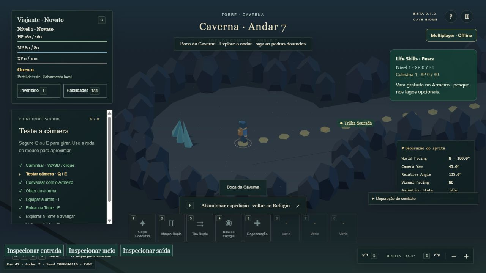

# Dungeon Master — Iteração 12 · CaveBiome

Beta 0.1.2 · Windows x64 · 05/10/2026. Entrega para playtest visual.

## 1. Auditoria inicial

A Torre usava `generateFloorGraph` para criar 9–11 regiões principais, desvios opcionais e conexões; `generateFloor` materializava terrenos circulares e corredores, encontros, cobertura, portais e lagos. Os três andares eram exclusivamente Floresta e o andar 3 possuía boss, baú e retorno. `AreaSession` controlava run, transições, gates e recompensa. Layout, topologia e decoração já utilizavam seeds determinísticas independentes. Colisão e navegação partilhavam o terreno caminhável, com validação de rotas por aresta. A câmera ortográfica orbitava o jogador; assets ambientais eram primitivas low-poly Three.js, com personagens em sprites.

A densidade vinha de regiões alternadas, duas passagens obrigatórias e desvios, não de um retângulo livre. Havia dependências explícitas de Floresta nos nomes, renderer, HUD e objetivos; limites de três andares estavam acoplados à geração e à lógica do boss.

Antes de modificar código: **364/364 testes**, zero falhas (109,9 s), e build web aprovada, 72 módulos. [Baseline](ITERACAO-12-BASELINE.txt) · [Build inicial](ITERACAO-12-BASELINE-BUILD.txt).

## 2. Arquitetura de biomas

`src/world/biomes.js` centraliza FOREST, CAVE, FOREST_TO_CAVE e CAVE_TO_FOREST. Cada ambiente possui tipo, nome, origem, destino e direção de transição. O mundo registra `floorEnvironment` e `floorRole` separadamente. O mesmo FloorGraph, materializador, colisão e navegação atendem todos os ambientes; não foi criado outro gerador independente.

O portal normal mantém o vertical slice de três andares. No Refúgio, **Explorar biomas** permite começar na primeira ocorrência do ambiente escolhido dentro de uma sequência procedural real, e seguir seus próximos andares. Essa rota é de playtest, sem boss nem baú final, com retorno pelo portal da entrada. O avanço é gerado sob demanda, com limite de 50 nesta rota; não há 50 andares artesanais. XP e itens continuam sujeitos ao sistema normal e são preservados.

## 3. Máquina/regra de transições

Um estado contém `currentBiome` e `pureFloors`. Em Forest só é válido outro Forest ou ForestToCave; em Cave, outro Cave ou CaveToForest. `advanceBiome` rejeita saltos diretos e transições incompatíveis. A transição estabelece o bioma seguinte e zera a contagem de pisos puros. A escolha rápida de playtest é um ponto de entrada de teste, não uma exceção durante a progressão entre andares.

## 4. Permanência de bioma

Configuração: mínimo **3**, máximo **7** andares puros, com chance **40%** de transição em cada escolha após o mínimo. Ao atingir sete, a transição é obrigatória. O piso de transição não conta como piso puro. Assim, há variedade de duração sem permitir regiões indefinidas. Números centralizados em `BIOME_RULES`.

## 5. Determinismo

A sequência usa o stream `seed + :biome-sequence:v1`, independente da topologia, geometria, encontros e decoração. Repetir seed e parâmetros reproduz ambiente e layout. A recuperação de falha geométrica mantém o ambiente originalmente escolhido. O debug mostra seed, andar e tipo ambiental; `biomeSequence(seed, count)` permite inspecionar sequências sem renderizar. A seleção de uma nova run mantém a geração de seed já existente.

## 6. Cave

A Caverna possui bordas rochosas volumétricas, câmaras e passagens, pilares naturais, cristais emissivos, fungos decorativos, lagos subterrâneos e atmosfera azulada mais escura. Algumas câmaras têm raio ajustado e os corredores ficam ligeiramente mais fechados; regiões de combate mantêm raio 10, e passagens preservam espaço navegável. Os volumes ambientais ficam nas bordas; coberturas sólidas usam os obstáculos existentes. Não há teto que esconda personagem e combate. Não foi introduzido sistema de iluminação complexo nem escuridão consumível.

## 7. ForestToCave

A transição acrescenta duas regiões principais, cerca de 18% sobre o perfil de 11 regiões. O primeiro trecho é florestal, o centro mistura vegetação e rocha e o último trecho é subterrâneo. Terreno, bordas, landmarks e atmosfera acompanham uma interpolação suave da posição longitudinal. Spawn permanece na origem Forest e a saída termina no lado Cave.

## 8. CaveToForest

Usa o sentido inverso explícito: spawn subterrâneo, mistura gradual e saída florestal com luz e vegetação. Não é uma inversão aleatória de um mapa sem direção. A orientação entrada→saída do grafo determina a distribuição ambiental, inclusive nos bolsões opcionais.

## 9. Preparação para Mining

Cristais, formações rochosas e pilares funcionam exclusivamente como decoração/landmarks. Não há picareta, minério coletável, interação mineral, XP de Mining, receita ou Smithing. Nenhum recurso novo entrou no inventário ou na economia.

## 10. Boss Floors

`floorRole` distingue normal e boss independentemente de `floorEnvironment`. A lógica de completar, ativar boss e voltar ao Refúgio usa esse papel, em vez de presumir que todo andar a partir do 3 é final. O percurso original continua com boss no andar 3, atraso, baú e recompensa preservados. Testes geram boss nos quatro ambientes. A rota adicional de playtest usa papel normal, sem criar novos bosses.

## 11. Persistent Floors

O mundo já contém número do andar, run seed, seed de geometria, ambiente explícito, direção, papel e grafo/layout serializável. A sequência e a geração permanecem separadas do estado da run. Não há persistência permanente de layouts, backend ou FloorRecord armazenado; nenhuma run passou a integrar o save do personagem.

## 12. Testes procedurais

**100 seeds × 50 pisos = 5.000 posições ambientais/grafos**, repetidos para verificar determinismo, conectividade e invariantes de transição. Além disso, **40 layouts físicos** (10 seeds × 4 ambientes), também repetidos, verificam spawn, gate resolvido em ordem, encontros, desvios, saída e serialização ambiental. Há testes de boss ortogonal, travessia com movimento real em Cave e nas duas transições, e avanço de sessão após CaveToForest. [Log específico](ITERACAO-12-PROCEDURAL.txt).

O volume de 5.000 verifica sequência e topologia; a materialização física mais cara tem a amostra separada de 40 mapas. Não confundir os dois níveis de cobertura.

## 13. Regressão

Baseline: **364 aprovados**. Final: **373 aprovados**, zero falhas e zero ignorados, 184,8 s. Foram adicionados nove testes; a antiga expectativa de rejeitar andar 4 passou a rejeitar andar 0, pois o limite de três andares foi conscientemente removido do gerador. O teste de hashes confirma topologia, geometria, encontros e landmarks dos pisos originais idênticos para as seeds de referência.

Um smoke adicional de combate usou o runtime real em Cave: espada reduziu o alvo de 120 para 83 HP, cajado de 120 para 63 HP; ambos provocaram reação do inimigo e preservaram o jogador vivo. Não houve remoção de colisão ou terreno nesse teste. [Suíte completa](ITERACAO-12-TESTES.txt) · [Combate](ITERACAO-12-COMBAT-SMOKE.json).

## 14. Validação visual

Observado no navegador local, em perfil `test=1`, seed 42: Refúgio, aquisição e equipamento de cajado, abertura do seletor, Floresta, Caverna, entrada e saída das duas transições, região intermediária mista, lagos, portais e retorno ao Refúgio. A câmera respondeu à rotação, e não foram registrados erros de console na inspeção. O equipamento continuou disponível após a recarga do perfil de teste.

Para observar os extremos sem repetir campanhas, foram usados botões explícitos de inspeção, disponíveis somente com `test=1&debug=1`. Eles posicionam o personagem nas regiões; não comprovam travessia manual ou combate visual completo. A navegação e combate têm evidências automatizadas separadas. Não foi feita instalação interativa nem inspeção da janela nativa desta build. Não marcar esses itens como aprovados.

[Floresta](capturas/iteracao-12-forest.png) · [ForestToCave: entrada](capturas/iteracao-12-forest-to-cave-entrada.png) · [Meio](capturas/iteracao-12-transicao-meio.png) · [Saída](capturas/iteracao-12-forest-to-cave-saida.png) · [CaveToForest: entrada](capturas/iteracao-12-cave-to-forest-entrada.png) · [Saída](capturas/iteracao-12-cave-to-forest-saida.png).

## 15. Multiplayer

O usuário informou aprovação real do Multiplayer 01 entre dois PCs em redes diferentes. Nesta iteração, servidor, endpoint, protocolo, capacidade, Origin, heartbeat e reconexão não foram alterados. Os testes multiplayer existentes passaram na suíte completa. Não foi realizado novo deploy, teste de carga ou desenvolvimento de multiplayer. A entrada na Torre continua usando a integração de saída de presença já existente.

## 16. Saves

Nenhum save foi apagado, nenhuma versão de esquema foi modificada e não houve migração. O perfil desktop e o App ID permanecem os mesmos. Os layouts continuam temporários. O teste visual usou o perfil de navegador separado; a instalação sobre o save desktop anterior ainda deve ser conferida pelo usuário no checklist.

## 17. Build web

Build de produção aprovada: **74 módulos**; JS **758,96 kB / 208,50 kB gzip**; CSS **26,08 kB / 7,02 kB gzip**; HTML **7,79 kB / 3,09 kB gzip**. Permanece apenas o aviso preexistente de chunk acima de 500 kB, sem refatoração paralela.

## 18. Build desktop

Pipeline `desktop:package:playtest`, Windows x64, Electron 44.5.1 e electron-builder 26.15.3. Segurança, protocolo `dungeon://game`, endpoint público e perfil mantidos. Staging separado em `release/cave-biome-build/`. Empacotamento final concluído com código zero. A inspeção do ASAR confirmou versão, biomas, seletor e configuração multiplayer idêntica à anterior; o checklist embutido confere com o arquivo distribuído. [Log final](ITERACAO-12-BUILD-DESKTOP.txt).

## 19. Instalador

Setup **DungeonMaster-Beta-0.1.2-CaveBiome-Setup.exe**, versão de produto 0.1.2 e versão Windows configurada 0.1.2.1. Portable também atualizado. Builds anteriores preservadas. Instalação por usuário e preservação de AppData mantidas. Build sem assinatura digital, como as anteriores.

## 20. Artefatos

Pasta final: `release/cave-biome-playtest/`. Apenas executáveis, LEIA-ME, checklist e manifesto. Tamanhos, caminhos completos e SHA-256 estão no [manifesto](../release/cave-biome-playtest/ARTEFATOS.txt).

| Arquivo | Bytes | SHA-256 |
|---|---:|---|
| CHECKLIST-CAVE-BIOME.txt | 1519 | 3A96EE0FCA62FA28DF1FDB8D766C64C1FC934AB781CC19B5EB295B4724BC95B3 |
| DungeonMaster-Beta-0.1.2-CaveBiome-Portable.exe | 111264186 | 9E2AD1BA06D0BBB7D9E1B76FBBB81A7013C93DD5FF8CF2188A46F90239599A08 |
| DungeonMaster-Beta-0.1.2-CaveBiome-Setup.exe | 111494265 | 900D37EE5E75D08652EF0114AC11FCF1D396F2D07A9AD199818FF22732224CF3 |
| LEIA-ME.txt | 3652 | 2FA32AA7D83720A24E6125CA912EBA3E177104253F622752516C9D609B892D24 |

## 21. ARQUIVO PARA PLAYTEST

**INSTALE ESTE ARQUIVO PARA TESTAR A ITERAÇÃO DE CAVERNA:**

`C:\Users\theuz\.codex\.chatgpt-projects\g-p-6ab572bee00c8191a99fc6be7aeb7536\release\cave-biome-playtest\DungeonMaster-Beta-0.1.2-CaveBiome-Setup.exe`

No Refúgio, equipe uma arma e clique em **Explorar biomas**. Escolha o ambiente. Use o portal da entrada para retornar. O portal normal mantém os três andares originais.

## 22. Testes que EU ainda preciso executar

Preencha [CHECKLIST-CAVE-BIOME.txt](../release/cave-biome-playtest/CHECKLIST-CAVE-BIOME.txt): instalação, abertura, save anterior, reconhecimento dos ambientes, percurso com colisão e câmera, combate, inimigos, saída, transições, Fishing, Cooking, inventário, fechar/reabrir e conexão do Refúgio. Não é necessário repetir toda a campanha para cada alteração.

## 23. Limitações conhecidas

Assets low-poly provisórios; ajuste visual de luz e densidade depende do playtest. Não há teto fechado. Os inimigos e valores de combate após o andar 3 reutilizam o perfil do terceiro andar, sem curva de endgame. A rota de biomas é explicitamente de teste e não uma campanha de 50 pisos balanceados. Instalação e janela nativa não foram testadas manualmente. Capturas de extremos usaram atalhos de inspeção, não travessia completa. Não há Mining, Smithing, persistência de pisos, terceiro bioma ou multiplayer da Torre.

## 24. Próximo passo recomendado

Realizar o playtest visual da Caverna. Se aprovado, a próxima etapa conceitual é **Mining**. Não foi iniciada nesta entrega.

